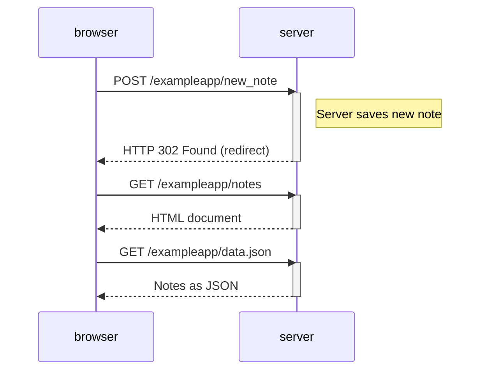
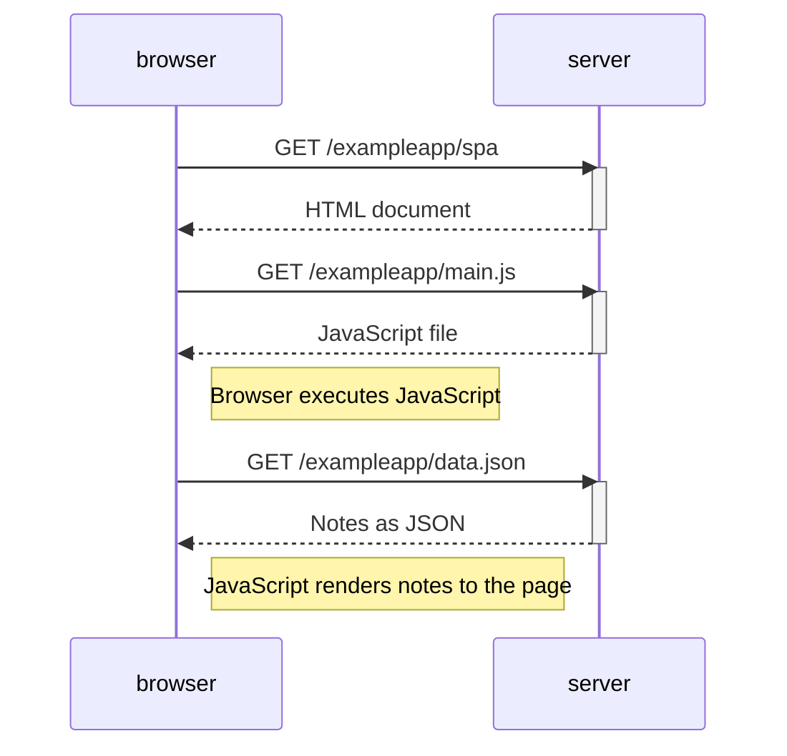
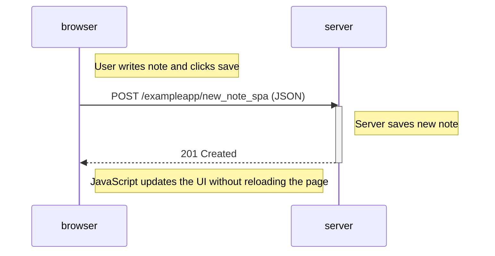

# Full stack open osa 0

## 0.4

```mermaid
sequenceDiagram
    participant browser
    participant server

    browser->>server: POST /exampleapp/new_note
    activate server
    Note right of server: Server saves new note
    server-->>browser: HTTP 302 Found (redirect)
    deactivate server

    browser->>server: GET /exampleapp/notes
    activate server
    server-->>browser: HTML document
    deactivate server

    browser->>server: GET /exampleapp/data.json
    activate server
    server-->>browser: Notes as JSON
    deactivate server


```

## 0sa0.5

```mermaid

sequenceDiagram
    participant browser
    participant server

    browser->>server: GET /exampleapp/spa
    activate server
    server-->>browser: HTML document
    deactivate server

    browser->>server: GET /exampleapp/main.js
    activate server
    server-->>browser: JavaScript file
    deactivate server

    Note right of browser: Browser executes JavaScript

    browser->>server: GET /exampleapp/data.json
    activate server
    server-->>browser: Notes as JSON
    deactivate server

    Note right of browser: JavaScript renders notes to the page
```

## Osa 0.6

```mermaid

sequenceDiagram
    participant browser
    participant server

    Note right of browser: User writes note and clicks save

    browser->>server: POST /exampleapp/new_note_spa (JSON)
    activate server
    Note right of server: Server saves new note
    server-->>browser: 201 Created
    deactivate server

    Note right of browser: JavaScript updates the UI without reloading the page
```
